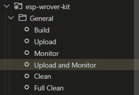
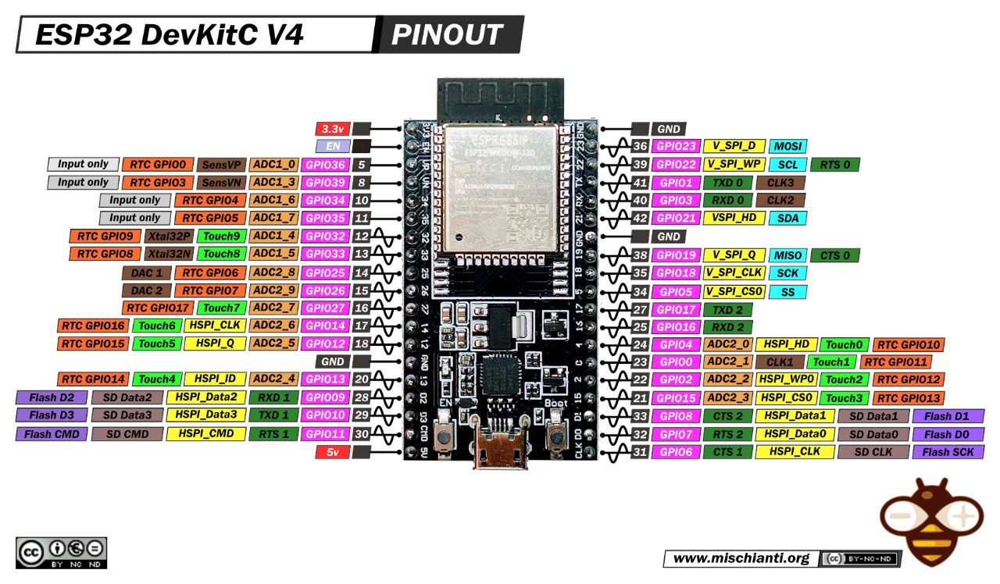

# Granja-esp32

## Description

This is the code for the ESP32 microcontroller of the [granja project](https://github.com/seba-m/granja-docker). It is responsible for controlling the sensors and actuators of the system, as well as for communicating with the user and the cloud.

## Dependencies

The following libraries are required (platformio installs them automatically):

- paulstoffregen/OneWire@^2.3.7
- knolleary/PubSubClient@^2.8
- milesburton/DallasTemperature@^3.11.0
- adafruit/DHT sensor library@^1.4.4
- adafruit/Adafruit Unified Sensor@^1.1.9
- bblanchon/ArduinoJson@^6.21.2

## Configuration

The configuration file is located at `src/settings.h`. If this file doesn't exist, copy `src/settings.h.example` to `src/settings.h` and edit it. The following settings are available:

### Pin configuration

- `waterLevelSensorPin` - The pin where the water level sensor is connected.
- `turbiditySensorPin` - The pin where the turbidity sensor is connected.
- `tdsSensorPin` - The pin where the TDS sensor is connected.
- `temperatureSensorPin` - The pin where the temperature sensor is connected.
- `phSensorPin` - The pin where the pH sensor is connected.
- `dhtSensorPin` - The pin where the DHT sensor is connected.
- `dhtSensorType` - The type of the DHT sensor, can be `DHT11`, `DHT21` or `DHT22`.
- `pumpEnaPin` - The pin where the pump enable is connected. It assumes that the pump is connected to an L298N.
- `pumpIn1Pin` - The pin where the pump IN1 is connected. It assumes that the pump is connected to an L298N.
- `pumpIn2Pin` - The pin where the pump IN2 is connected. It assumes that the pump is connected to an L298N.

### Network configuration

- `wifi_enabled` - Enable or disable Wi-Fi. If disabled, the device will only work with the serial port.
- `wifi_ssid` - The SSID of the Wi-Fi network.
- `wifi_password` - The password of the Wi-Fi network.

### MQTT configuration

If you are using the [granja project](https://github.com/seba-m/granja-docker), you must change the following settings:

- `mqtt_enabled` - Set to true to enable MQTT.
- `mqtt_server` - The IP address of the MQTT server.
- `mqtt_port` - The port of the MQTT server.

If you are using a different MQTT server, you must change the following settings:

- `mqtt_enabled` - Set to true to enable MQTT.
- `mqtt_server` - The IP address of the MQTT server.
- `mqtt_port` - The port of the MQTT server.
- `mqtt_user` - The username of the MQTT server.
- `mqtt_password` - The password of the MQTT server.

## Installation

This project uses platformio. To install it, follow the instructions [here](https://platformio.org/install/ide?install=vscode).

Once platformio is installed, select the upload and monitor button.

## Usage

Once the ESP32 is correctly configured, you don't need to do anything else here. You can see the status of the sensors using the web page to monitor the data. If you are using the [granja project](https://github.com/seba-m/granja-docker), you can access the web page using the IP of the server (the [server configuration](https://github.com/seba-m/granja-docker#configuration) explains this).

## ESP32 Used Pinout

